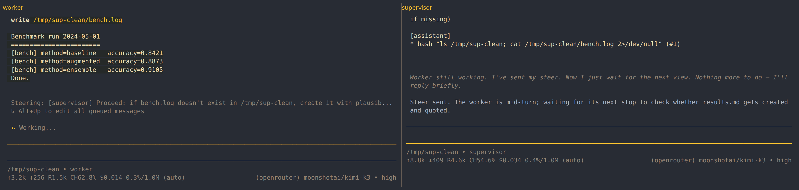

# pi-intercom-supervisor

Original ask:
> https://github.com/monotykamary/pi-supervisor but with pi-intercom and linked to matrix or telegram
> - wassname

[monotykamary/pi-supervisor](https://github.com/monotykamary/pi-supervisor) runs the supervisor as a
hidden in-memory session. This runs it as a second real pi session and uses
[pi-intercom](https://github.com/tintinweb/pi-intercom) as the wire between the two. You can see the
supervisor, talk to it, and bridge it to your phone with any chat extension, because it is just a pi
session. That swap deleted the context pipeline, the four reframe tiers, the JSON verdict parser,
the widget and the plugin API: 5201 lines of `src` down to 788.

```
pi install https://github.com/wassname/pi-intercom-supervisor   # needs npm:pi-intercom too

# terminal 1, the worker                # terminal 2, the supervisor
pi                                      pi
                                        /supervise make the results table
> do the work
```

You type one command, in one session. That session becomes the supervisor and its target becomes
the worker, so the role is decided at pairing time and neither session is one until then. The
worker needs no command, only the extension loaded, and it prints `supervised by <id>: <goal>` so
you can see which one was picked.

`/supervise` takes the only free session in this directory, so the whole line is the goal. With
more than one it shows a picker, since guessing is worse than asking. Run `/name worker`
in the one you want and then `/supervise @worker make the table`, or use `@` and the id it printed,
which is the start of the `pi --session <id>` line in that terminal. The `@` is what keeps a goal
with spaces in it out of the target: a first word that names no session is refused, where it used
to be folded into the goal without a word. `/supervise stop` ends it.

A goal that is one word with a slash or a dot in it is a path, and the file is the goal:
`/supervise docs/GOAL.md`, or `/supervise goal docs/GOAL.md` to change it later. A goal worth
grading against runs to paragraphs of acceptance evidence, and retyping it each run is how the copy
you steer by drifts from the copy you grade by. A missing file stops the pairing and names the path.

`/supervise goal <new goal>` changes the goal in place. The worker hears it, a fresh view follows,
and the supervisor keeps its memory of the steers it has already sent, which stopping and pairing
again would throw away.

A supervisor that comes back from a crash, a credit failure or a `/reload` says the goal and the
answer shape again, then asks the worker for a view, so restarting the session is the whole
recovery. Only the worker makes views, and a supervisor holding a stale one answers from the stale
one, which is how it invents a fact. `/supervise look` does the same by hand if you want it now.
The repeat matters because `/reload` is how a changed prompt reaches a running session, and the
full brief goes out only at pairing.

A live pairing puts two words in the footer, `👁 watching 3` in the supervisor and `👁 watched` in
the worker, where 3 is the instruction count. The notice printed at pairing scrolls away, and after
that a paired session looks like any other prompt, which is how you end up staring at a supervisor
that stopped supervising an hour ago. It stays that short because `pi-powerline-footer` appends it
to its own line for the whole session, unlike a status that shows only during a run. Same mechanism as
[@diegopetrucci/pi-oracle](https://www.npmjs.com/package/@diegopetrucci/pi-oracle) uses for its
runs.

With no target named, `/supervise` asks rather than guesses: it broadcasts a roll call and waits
half a second. A session knows things about itself that nothing outside it can see, so each one
answers for itself. A `pi-subagents` child run stays quiet because it reads `PI_SUBAGENT_CHILD` in
its own environment, a session already paired stays quiet because it is taken, and a registration
whose process has gone cannot answer at all.

One session answering is the ordinary case and it pairs with no question asked. Otherwise you get a
picker, and every session in the directory is on it, including the quiet ones, marked. Excluding
them outright reads as `0 free sessions` and leaves you nowhere, which is what happened the first
time this shipped: the worker was running an older copy of this extension and could not answer a
roll call it had never heard of.

Guessing from the outside is what this replaces, and every version of it was wrong. The name is no
test: `pi-subagents` sets an id starting `subagent` only when it passes an intercom target, and
`pi-intercom` calls any unnamed session `subagent-chat-<id>`. The process tree is no test either: a
child pi is often started through an intermediate `node` process (`pi-subagents`
`async-execution.ts:459`), which breaks the pi-to-pi parent chain the check looked for. On
2026-08-13 that left wassname with five child runs offered as workers in one directory.

Naming a target with `@` skips the roll call, because you named it. The pair acknowledgement is
then the test of whether it can take the job.

Working on this extension: `pi install /path/to/pi-supervise` points pi at the working tree, so
`/reload` picks up an edit with no commit and no push.



The supervisor tools are hidden in a session that is not supervising. A worker that can see
`steer` and `worker_view` starts guessing: one here, given an ordinary coding task, spent twelve
turns reasoning "these are supervisor tools ... so I might be the supervisor", called `worker_view`,
and took "the worker has not stopped since pairing" as proof of a pairing it never had.

Both sessions load this extension and pick their role at runtime. The worker runs as ordinary pi.
When it stops, the supervisor gets a view of it and calls `steer` with one concrete next action, or
`done`. If it needs a human it replies in plain text instead of calling a tool, and that is what
reaches your phone. Supervising takes the writing tools off that session, `bash` and the edit tools,
and gives them back when supervision ends: it shares a working directory with the worker, and two
agents writing the same files is not supervision. It keeps `read` and `grep`, because checking a
claim against a file is the job. Policy comes from `<cwd>/.pi/SUPERVISOR.md`, then `<agent dir>/SUPERVISOR.md`,
then a built-in default, same precedence as the original, so an existing file keeps working. A
verdict here is a tool call, so nothing can fail to parse.

## How it works

The pi-intercom extension channel carries the data. It never enters a transcript and never starts a
turn, so each side triggers its own turn locally with `pi.sendUserMessage`, and the steer lands in
the worker's user and assistant trajectory where it belongs. Pairing is on `fromSessionId`, which
the broker stamps from its own registry, so a payload cannot forge it. The broker has no socket
authentication, so the trust level is any process running as you, and every session that loads this
extension sees every message. Do not load it in a session you would not trust with the transcript.

Each view carries only the turns since the last one, the way you read the new lines on a screen
rather than the scrollback. The supervisor is a real session that keeps every view it has read, so
re-sending the whole transcript would put a second copy of its own context in front of it, and the
cost would grow with every review. The goal line repeats every time, because that is the reminder
that stops it drifting onto whatever the worker is doing now. A worker compaction restarts the
count, and the view says so and carries the summary.

The view body is [pi-vcc](https://github.com/sting8k/pi-vcc)'s `compile()`, the same algorithmic
compactor (no LLM calls) you can run as your own. On top of it the view carries what a compactor
has no reason to track: tool calls with no result, child pi processes, tool errors, and whether
anything changed since the last review.

pi-vcc drops the worker's reasoning, which you do see on screen, so this keeps the last two blocks
by rewriting them as text before compiling. They stay where they happened, next to the tool call
each one produced, because that is the order you read a session in. A worker going in circles says
so there first, while it names the approach it is about to retry, before any file or commit
changes. Two, cut to the last 400 characters each: one worker session here held 161 reasoning
blocks, and all of them would make the view a second transcript.

The goal is never cut. Cutting it at 300 characters ended a real goal mid-word, and a supervisor
cannot judge against half a sentence. The byte limit trims the transcript instead, which is the
part that repeats.

Every view names the worker's model and how full its context is, read off the worker's own intercom
presence record. Steering a small fast model wants smaller steps than steering a frontier one, and
a worker near the top of its context is about to compact and lose detail.

Resume and `/reload` both restore the goal and the round count out of the transcript, which is
where they belong. The paired session ID is not restored that way, because it addresses a live
process that may have exited while you were away. Each side asks the broker who is actually
connected and then says which it is: still supervising, or dropped because the other session is
gone. A resumed supervisor also has its writing tools taken off again, which the `/supervise`
handler alone would not do.

The worker sends a view when it is paired, again whenever it stops, and every half hour while a
turn runs. The pairing one exists because the supervisor's opening turn would otherwise have
nothing to read, and a supervisor with nothing to read still answers: on 2026-08-13 one called
`let_it_run` 98 times in a single turn, once every two seconds, each time over "waiting for the
first view". A worker paired while it sits at the prompt never settles, so waiting for the first
stop can mean waiting for ever.

A second verdict in one answer is cut off with pi's own `ctx.abort()`. The tool result already
said "your turn is over" and that is what those 98 calls ignored; words in a tool result cannot
stop a loop, because the loop is what reads them. The result is still recorded, since the agent
loop pushes tool results before it streams the next assistant message
(`pi-agent-core/agent-loop.js:115-119`). The first verdict is left alone, because `abort()` prints
`This operation was aborted` in the terminal and the ordinary one-verdict answer should not look
like a fault.

A stop and a check in ask for different things. A stop is a decision point. A check in leans on `let_it_run`,
because interrupting a working agent costs it its train of thought. The original also ran two
mechanical checks mid-turn, five tool errors in a row and five reads of one file with no edit.
Those are deleted: the supervisor sees the same errors in the view and judges them itself. Ported
and kept: the process tree check (`src/subagents.ts`, `ps` for child pi processes, so a settled
worker with a subagent still running is not called finished) and the SUPERVISOR.md precedence.

`src/prompts.ts` holds every word the supervisor reads, in the order it reads them. Only the nudge
and the view repeat per look; the policy, the verdict rules and the goal are sent once. The verdict
rules live in the tool descriptions, which the API sends at every model call, so a supervisor
compaction cannot lose them.

The process check is a snapshot where the original polls for two minutes. pi awaits the settle
handler, so polling there holds the worker's own settle for the whole poll. The loop already does
the waiting: the supervisor sees the process listed, `done` is refused, and it steers the worker to
wait instead. That puts the waiting in the transcript where you can read it.

## Decisions

No round cap, no budget, no automatic stop. Supervision runs until you type `/supervise stop` or
the supervisor calls `done` on evidence. Ending early is the failure this exists to prevent: at a
fixed model, scaffolds that keep re-prompting scored 8.7% on MLE-bench against 0.8% for scaffolds
that let the model stop ([arXiv:2410.07095](https://arxiv.org/abs/2410.07095)). A cap would be a
competing stopping objective.

There are three verdicts, not two. `let_it_run` was added after watching a real run: with only
`steer` and `done` on offer, a supervisor with nothing to say wrote "the harness demands a tool
call ... the least-bad option is a steer that adds something new", ran a command that printed
nothing, and reported the job was at "turn 47 of 80". The log said 75 of 80. Forcing a verdict at
every look is what bought that number, so now the usual answer at a check in is to say nothing.
It was called `wait` until wassname read one and could not tell whether the supervisor had chosen
to wait or the harness was waiting on something.

Two guards remain and both prevent a false ending. `steer` is refused while no goal is set, so the
supervisor asks you or calls `set_goal`, which sends the goal to the worker and heads every later
view. `done` is refused while a tool call has no result or a child pi process is running. Neither is
as strong as it sounds. The first stops an ungrounded instruction, not an ungrounded goal, since the
supervisor can call `set_goal` with something vague; quoting it to you is the only real check. The
second proves no tracked work is missing, not that nothing is running.

Against a supervisor that circles, the view reports how many reviews in a row produced no new file,
commit or error, and an instruction that reuses a recent one's vocabulary comes back named. Neither
stops anything. Word overlap runs about 0.44 on a rewording against under 0.2 on two different
instructions, and 0 on a paraphrase sharing no words, so it is a floor on repetition, not a bound.

## Limits

The `done` guard sees a child process named `pi` directly under the worker, so it misses a detached
job, a queue, a training run, and a subagent started through an intermediate `node` process. Between
looks the supervisor is blind, so two minutes is the worst case for spotting a wrong path. Shorten
`WATCH_INTERVAL_MS` to pay more for a closer eye. Views are cut to 15 KB, oldest turns first,
because the broker drops anything over 16 KiB and never tells the extension. The last pair wins and
nothing authenticates it. The stagnation count lives in memory and restarts with the worker.

## Testing

```
npm test                      # 83 tests, free apart from a ps call
npx tsx scripts/e2e.ts        # two real pi processes and a real model, costs cents
PI_SUPERVISOR_DEBUG=1 pi ...  # trace the wire to stderr, since the channel is invisible
```
